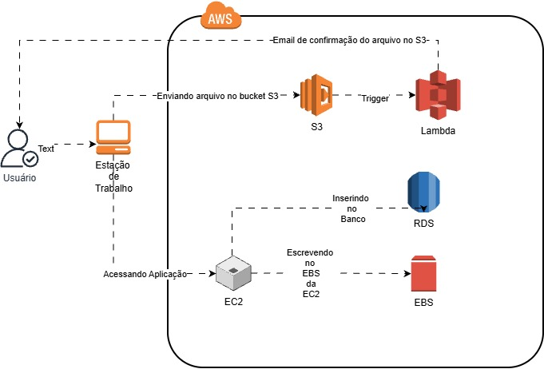

# Desafio 01 - Arquitetura Integrada com AWS

## 📖 Entendendo o Desafio

Vou colocar em prática tudo aquilo que aprendi até aqui nas aulas. Estou explorando todos os conceitos abordados, aplicando meus conhecimentos em um ambiente prático e documentando minha experiência de forma clara e estruturada.

O meu objetivo é demonstrar minha compreensão dos temas discutidos, criando um material que sirva não apenas como comprovação do meu aprendizado, mas também como referência para meus estudos futuros e implementações em projetos reais.

## 🎯 Descrição do Desafio

Neste laboratório, estou consolidando meus conhecimentos em uma arquitetura completa na Amazon Web Services (AWS), integrando múltiplos serviços em um fluxo prático. O projeto envolve a construção de uma solução end-to-end que demonstra como diferentes componentes da AWS trabalham juntos.

A arquitetura implementada segue este fluxo:

**Usuário** → **Estação de Trabalho** → **Amazon S3** → **AWS Lambda** → **Amazon EC2** → **Amazon RDS** + **Amazon EBS**

### Serviços AWS Envolvidos

- **Amazon S3:** Armazenamento de arquivos enviados pelo usuário
- **AWS Lambda:** Processamento automático disparado quando um arquivo é enviado
- **Amazon EC2:** Instância de computação que processa dados
- **Amazon RDS:** Banco de dados relacional para armazenamento de informações
- **Amazon EBS:** Armazenamento em bloco para a instância EC2
- **Email de Confirmação:** Notificação automática do processo

## 📚 Objetivos de Aprendizagem

Com a conclusão deste desafio, estou desenvolvendo as seguintes competências:

- **Integrar múltiplos serviços AWS:** Estou aprendendo como diferentes componentes da AWS se comunicam entre si, criando uma arquitetura robusta e escalável.

- **Gerenciar instâncias EC2 e armazenamento:** Estou trabalhando diretamente com instâncias EC2, configurando volumes EBS e compreendendo o funcionamento real da computação em nuvem.

- **Implementar automação com Lambda:** Estou entendendo como usar funções serverless para automatizar processos e reagir a eventos na AWS.

- **Documentar arquiteturas técnicas:** Estou desenvolvendo a habilidade de descrever e documentar arquiteturas complexas de forma clara e estruturada.

- **Utilizar o GitHub para documentação técnica:** Estou dominando o versionamento e organização de repositórios para facilitar o compartilhamento e colaboração.

## 🏗️ Arquitetura Proposta

O fluxo da arquitetura funciona assim:

1. **Entrada do Usuário:** Usuário envia um arquivo de texto através da Estação de Trabalho
2. **Armazenamento:** O arquivo é enviado para um bucket S3
3. **Automação:** Um trigger dispara uma função Lambda
4. **Processamento:** Lambda envia informações para a EC2
5. **Notificação:** Email de confirmação é enviado
6. **Persistência:** Os dados são inseridos no banco RDS
7. **Armazenamento Local:** Os dados também são salvos no EBS da EC2

## 📝 Anotações e Insights

Neste repositório, estou documentando:

- **Passo a passo:** Como criar e configurar cada serviço AWS
- **Conceitos-chave:** Entendimento prático de cada componente
- **Desafios encontrados:** Dificuldades e como as resolvi
- **Boas práticas:** O que aprendi sobre segurança, otimização e organização
- **Screenshots e diagramas:** Visualizações dos processos
- **Links úteis:** Referências da documentação oficial consultada

## ✅ Critérios de Sucesso

Considero este desafio completo quando eu:

1. ✅ Configurar um bucket S3 para receber arquivos
2. ✅ Criar uma função Lambda que processa os eventos do S3
3. ✅ Provisionar uma instância EC2 funcional
4. ✅ Configurar um banco de dados RDS
5. ✅ Conectar e integrar todos os serviços
6. ✅ Documentar todo o processo em detalhes
7. ✅ Fazer commits significativos explicando cada etapa
8. ✅ Validar que a arquitetura funciona corretamente

## 🔧 Serviços Utilizados

| Serviço | Função | Status |
|---------|--------|--------|
| **S3** | Armazenamento de objetos | 🔄 |
| **Lambda** | Processamento serverless | 🔄 |
| **EC2** | Computação na nuvem | 🔄 |
| **RDS** | Banco de dados relacional | 🔄 |
| **EBS** | Armazenamento em bloco | 🔄 |
| **SNS** | Envio de notificações/emails | 🔄 |

## 🚀 Próximos Passos

Estou iniciando agora mesmo meu laboratório prático seguindo a arquitetura proposta. Vou documentar cada etapa da implementação e compartilhar meus aprendizados ao longo do caminho. A melhor forma de aprender é fazendo!

---

**Bootcamp:** GFT - Fundamentos de Cloud com AWS  
**Plataforma:** Digital Innovation One (DIO)  
**Desafio:** 01 - Arquitetura Integrada  
**Data de Criação:** 2026  
**Status:** Em Desenvolvimento 🔄